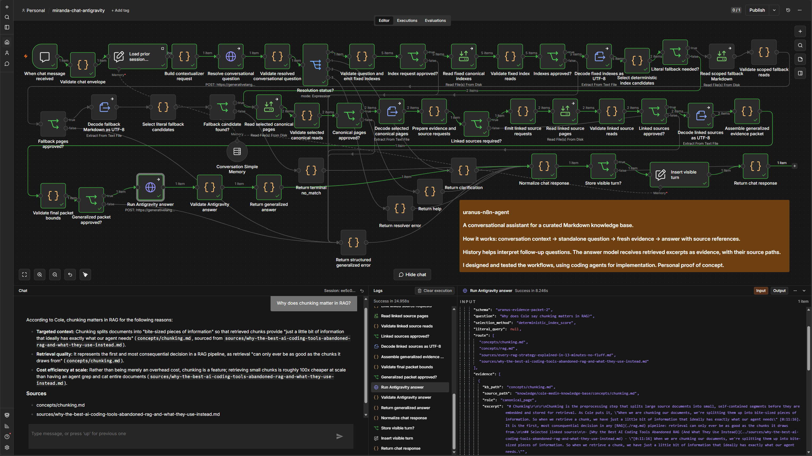

# Uranus: a conversational n8n knowledge assistant

Uranus is a personal proof of concept for answering questions over a curated, linked Markdown knowledge base. The current workflow combines conversational context, deterministic retrieval, and evidence-only answer generation in n8n.

The main artifact is [`miranda-chat-antigravity.json`](workflows/miranda-chat-antigravity.json). It resolves follow-up questions using bounded session history, retrieves fresh canonical pages and linked sources, and sends that evidence to the answer model. It uses no embeddings or vector store.

## Demonstration



The accepted capture shows the question **“Why does chunking matter in RAG?”**, the executed workflow, the answer node's input evidence, and the complete response with its Sources list. Open the image at full size to inspect the paths and excerpt.

The four reported retrieved pages include both paths cited in the answer. The two cited excerpts were also reviewed separately. This supports citation membership for this example; it does not establish that every generated claim is fully qualified. In particular, the answer's roughly 100x cost comparison comes from the KB's discussion of unstructured knowledge and omits that context. It is **not a measured performance result for Uranus**. See [Demonstration evidence](docs/demonstration.md).

This capture is from the conversational workflow, not the earlier agentic retry described below.

## How the current workflow works

```text
Chat Trigger: current message + sessionId
  -> load bounded session history
  -> resolve the message into a standalone question (Antigravity HTTP request)
  -> validate resolver JSON and route clarification, help, or retrieval
  -> score canonical indexes; use scoped literal fallback when needed
  -> read selected canonical pages and linked sources
  -> assemble and validate a bounded evidence packet
  -> generate an evidence-only answer (Antigravity HTTP request)
  -> store the visible user/assistant exchange
```

**History resolves the question; fresh retrieval supplies the evidence.** The final answer request receives the resolved question and evidence packet, not the conversation transcript. Earlier assistant claims therefore do not become sources merely by appearing in memory.

The two model steps use n8n HTTP Request nodes with the Interactions API contract configured in the export. Retrieval and branching are handled by workflow nodes rather than model-directed tool calls. A supported knowledge turn uses two model requests: one to resolve the question and one to answer. Clarification, help, and terminal `no_match` use only the resolver request; invalid chat envelopes use neither.

### Memory and grounding controls

- Simple Memory is keyed by the incoming `sessionId`, with an eight-exchange window.
- Resolver history is capped at 16 prior visible messages and 12,000 serialized characters; the oldest complete pairs are removed first.
- The current message is passed separately. Completed success, clarification, help, and no-match turns store one visible user/assistant pair; transient technical errors are not stored.
- Retrieval uses a fixed read-only KB root, validated Markdown paths, bounded reads and excerpts, and explicit error branches.
- Canonical indexes and literal fallback select candidates; selected pages and linked sources are read to build the answer evidence packet.
- Unsupported retrieval returns an explicit insufficient-evidence response without calling the answer model.
- The answer prompt requires canonical path citations. The output validator checks completed, nonempty model text; it does **not** deterministically verify every citation or claim.

The KB already provides indexes and typed Markdown links. Using that structure made retrieval and page-level provenance inspectable without adding embedding ingestion or a vector database. Lexical selection still has limitations for synonyms and questions outside the evaluated cases.

## Evaluation and current artifact status

The [chat handover](docs/antigravity-chat-handover.md) records operator-run tests after memory hardening on 2026-08-31:

| Scenario | Recorded result |
|---|---|
| Three-turn conversation: chunking, its costs, and whether the concepts must be used together | Passed |
| Pronoun-only question in a separate session | Asked for clarification without inheriting another session's context |
| Direct chunking retrieval | Passed |
| Literal fallback for “dumb zone” | Passed |
| Unsupported Kubernetes material | Terminal `no_match` |

These are a small, manually reviewed set, not an automated answer-quality benchmark. The later accepted demonstration provides a separate example of the conversational workflow in use.

**Validation status, 2026-09-16:** the current export passes the chat validator: `Antigravity chat workflow validation passed (49 nodes).` The validator now accounts for omitted n8n defaults and renamed nodes. Both requests now pin `gemini-3.7-flash`. The operator also reported a successful chunking question and contextual costs follow-up. See the [current validation record](docs/validation-status.md) for passed checks and known limits. The user accepted the current scope; no validation remains pending. The handover preserves the earlier 48-node checkpoint.

To reproduce the current static check from the repository root:

```bash
node scripts/validate-chat-antigravity.mjs
```

This checks the artifact, not live provider behavior or answer quality.

## What changed during development

### Agentic retrieval: plausible prose with unread citations

The earlier Gemini agent navigated the KB through `read_kb_page` and `find_kb_pages`. In an initial direct run, it listed five source paths that appeared as links but had never been opened. The execution trace exposed the mismatch. I required a successful-read ledger, a linked source-page read, and a final citation audit; the retry cited only pages returned by the tool.

For an unsupported question, a prompt-only one-search limit also proved insufficient: the agent broadened the query and searched twice. Returning structured `no_match`, `terminal: true`, and an explicit insufficient-evidence next action produced the intended stop in the recorded retry. These remain observed model-followed outcomes, not a deterministic final-answer guarantee. See [the historical evaluation](docs/evaluation.md).

### Deterministic evidence packets, then conversation

I next compared agentic navigation with deterministic retrieval followed by one answer call. The isolated [one-question pilot](docs/one-call-pilot.md) recorded 2,246 versus 26,957 total tokens for its fixed comparison. That result belongs to the historical pilot, not the current two-request chat design, and does not establish general savings.

The [generalized retrieval experiment](docs/generalized-one-call.md) extended selection across the KB's canonical indexes. The conversational version then added explicit question resolution and bounded session memory while preserving fresh retrieval for each answer.

### Artifact map

| Artifact | Purpose |
|---|---|
| [`miranda-chat-antigravity.json`](workflows/miranda-chat-antigravity.json) | Current conversational demonstration |
| [`miranda-chat-gemini-multi-call.json`](workflows/miranda-chat-gemini-multi-call.json) and [`kb-navigation.json`](workflows/kb-navigation.json) | Earlier agentic retrieval architecture |
| [`miranda-one-call-pilot.json`](workflows/miranda-one-call-pilot.json) | Isolated fixed-question measurement |
| [`miranda-one-call-generalized.json`](workflows/miranda-one-call-generalized.json) | Frozen stateless Antigravity comparison baseline |
| [`miranda-one-call-gemini.json`](workflows/miranda-one-call-gemini.json) | Frozen Gemini comparison copy |
| [`n8n-memory-probe.json`](workflows/n8n-memory-probe.json) | Memory diagnostic, not a runtime dependency |

Older Gemini setup and evaluation documents describe historical configurations. In particular, Gemini-oriented documentation and validators for the generalized experiment were retained after its provider changed; they are not current chat setup instructions.

## Run the conversational workflow locally

The recorded test environment was Docker-hosted n8n 2.26.4. This is the tested version, not a claim about current n8n or provider compatibility.

1. Obtain the external Cole Medin KB at the revision documented in [Third-party material](THIRD_PARTY.md), under `knowledge/cole-medin-knowledge-base/`.
2. Mount this repository read-only at `/home/node/.n8n-files/Uranus` in the n8n container. The configured KB root is `/home/node/.n8n-files/Uranus/knowledge/cole-medin-knowledge-base`.
3. Import [`miranda-chat-antigravity.json`](workflows/miranda-chat-antigravity.json) and inspect node compatibility and the validation status above. It is an inactive proof-of-concept export.
4. Bind your local HTTP Header Auth credential in both `Resolve conversational question` and `Run Antigravity answer`. Verify the configured preview API and agent are available for your environment; the export's credential references do not supply an API key.
5. Use the Chat Trigger test interface. Run the three-turn conversation and separate-session pronoun test, inspecting the loaded history, selected paths, evidence packet, and final response.

The conversational workflow reads the KB directly; it does not require the earlier `kb-navigation` subworkflow. The [handover](docs/antigravity-chat-handover.md) explains memory inspection and the recorded runtime behavior. The operator reported successful live answers after pinning Gemini 3.7; the current proof-of-concept validation is accepted with no checks pending.

## Limitations

- Personal proof of concept; no production deployment, multi-tenant design, or load testing.
- Small manual evaluation set; no automated live conversational regression suite or deterministic claim/citation verifier.
- In-process, single-instance memory. Persistence across restarts, re-imports, queue mode, or multiple workers must not be assumed.
- Browser-visible older chat may outlive server-side memory; inspect the session history in the execution trace.
- Non-vector retrieval with lexical matching; no demonstrated broad semantic recall or scalable search service.
- External KB required and not bundled. Provider preview availability and credentials are environment-dependent.
- No automatic provider retry, failover, or credential rotation.

## Ownership and AI assistance

I designed the architecture and evaluation criteria, operated and tested the system, and used AI coding agents extensively for implementation and iteration. I reviewed execution traces, challenged unsupported citations and repeated fallback searches, and evaluated whether changes preserved evidence quality.

The source KB is an external dependency, not my authored content. Its revision, attribution, and separation from this repository are documented in [Third-party material](THIRD_PARTY.md).
